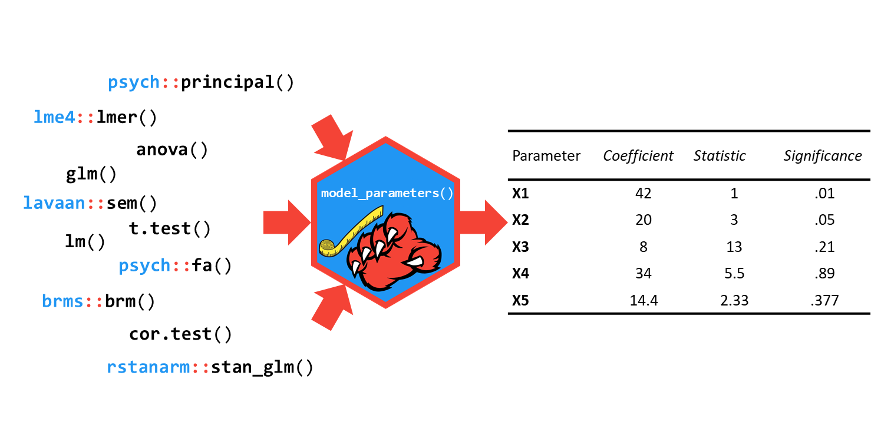
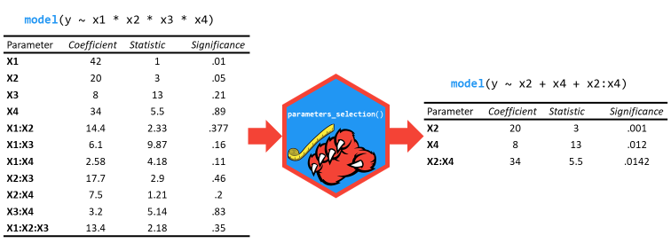

```{r, echo = FALSE}
knitr::opts_chunk$set(
  collapse = TRUE,
  dpi=300,
  tidy.opts=list(width.cutoff=60),
  # tidy=TRUE,
  fig.path = "man/figures/"
)
knitr::opts_chunk$set(comment="#")
options(knitr.kable.NA = '',
        digits = 1,
        width=60)

set.seed(333)
```

# parameters 

[](https://cran.r-project.org/package=parameters)
[](https://cran.r-project.org/package=parameters)
[](https://travis-ci.org/easystats/parameters)
[](https://codecov.io/gh/easystats/parameters)

***Describe and understand your model's parameters!***

`parameters`' primary goal is to provide utilities for processing the parameters of various statistical models. Beyond computing ***p*-values**, **CIs**, **Bayesian indices** and other measures for a wide variety of models, this package implements features like **bootstrapping** of parameters and models, **feature reduction** (feature extraction and variable selection).


## Installation


Run the following:

```{r eval=FALSE, message=FALSE, warning=FALSE}
install.packages("parameters")
```
```{r message=FALSE, warning=FALSE}
library("parameters")
```


## Documentation

[](https://easystats.github.io/parameters/)
[](https://easystats.github.io/blog/posts/)
[](https://easystats.github.io/parameters/reference/index.html)

Click on the buttons above to access the package [documentation](https://easystats.github.io/parameters/) and the [easystats blog](https://easystats.github.io/blog/posts/), and check-out these vignettes:


- [Parameters description](https://easystats.github.io/parameters/articles/model_parameters.html)
- [Bootstrapped parameters](https://easystats.github.io/parameters/articles/bootstrapping.html)
- [Parameters selection](https://easystats.github.io/parameters/articles/parameters_selection.html)
- [Feature reduction (PCA, cMDS, ICA...)](https://easystats.github.io/parameters/articles/parameters_reduction.html)
- [Structural models (EFA, CFA, SEM...)](https://easystats.github.io/parameters/articles/efa_cfa.html)

# Features
 
## Model's parameters description


 
The [`model_parameters()`](https://easystats.github.io/parameters/articles/model_parameters.html) function (that can be accessed via the `parameters()` shortcut) allows you to extract the parameters and their characteristics from various models in a consistent way. It can be considered as a lightweight alternative to [`broom::tidy()`](https://github.com/tidymodels/broom), with some notable differences: 

- The column names of the returned data frame are **specific** to their content. For instance, the column containing the statistic is named following the statistic name, i.e., *t*, *z*, etc., instead of a generic name such as *statistic* (**however**, you can get standardized (generic) column names using [`standardize_names()`](https://easystats.github.io/parameters/reference/standardize_names.html)).
- It is able to compute or extract indices not available by default, such as ***p*-values**, **CIs**, etc.
- It includes **feature engineering** capabilities, including parameters [**bootstrapping**](https://easystats.github.io/parameters/articles/bootstrapping.html).


### Classical Regression Models

```{r, warning=FALSE, message=FALSE}
model <- lm(Sepal.Width ~ Petal.Length * Species + Petal.Width, data = iris)

# regular model parameters
model_parameters(model)

# standardized parameters
model_parameters(model, standardize = "refit")
```

### Mixed Models

```{r, warning=FALSE, message=FALSE}
library(lme4)

model <- lmer(Sepal.Width ~ Petal.Length + (1|Species), data = iris)

# model parameters with CI, df and p-values based on Wald approximation
model_parameters(model)

# model parameters with CI, df and p-values based on Kenward-Roger approximation
model_parameters(model, df_method = "kenward")
```

### Structural Models

Besides many types of regression models and packages, it also works for other types of models, such as [**structural models**](https://easystats.github.io/parameters/articles/efa_cfa.html) (EFA, CFA, SEM...).

```{r, warning=FALSE, message=FALSE}
library(psych)

model <- psych::fa(attitude, nfactors = 3)
model_parameters(model)
```


## Variable and parameters selection


 
[`parameters_selection()`](https://easystats.github.io/parameters/articles/parameters_selection.html) can help you quickly select and retain the most relevant predictors using methods tailored for the model type.

```{r, warning=FALSE, message=FALSE}
library(dplyr)

lm(disp ~ ., data = mtcars) %>% 
  select_parameters() %>% 
  model_parameters()
```

This function also works for mixed or Bayesian models:

```{r, warning=FALSE, message=FALSE}
library(rstanarm)

stan_glm(mpg ~ ., data = mtcars, refresh = 0) %>% 
  select_parameters() %>% 
  model_parameters()
```

## Miscellaneous

This packages also contains a lot of [other useful functions](https://easystats.github.io/parameters/reference/index.html):

### Describe a Distribution

```{r, warning=FALSE, message=FALSE, eval=FALSE}
x <- rnorm(300)
describe_distribution(x)
```
```{r, warning=FALSE, message=FALSE, echo=FALSE}
knitr::kable(describe_distribution(rnorm(300)), digits = 1)
```

### Citation

In order to cite this package, please use the following citation:

Makowski D, Ben-Sachar M, Lüdecke D (2019). "Describe and understand your model's parameters." CRAN. R package, https://github.com/easystats/parameters.

Corresponding BibTeX entry:

@Article{,
  title = {Describe and understand your model's parameters},
  author = {Dominique Makowski and Mattan S. Ben-Shachar and Daniel
  Lüdecke},
  journal = {CRAN},
  year = {2019},
  note = {R package},
  url = {https://github.com/easystats/parameters},
}
