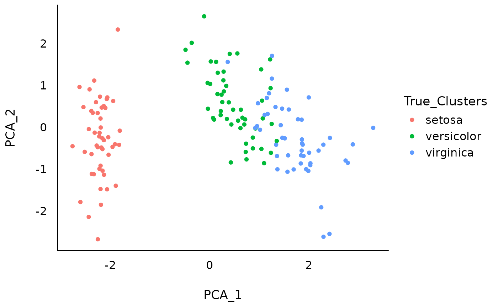
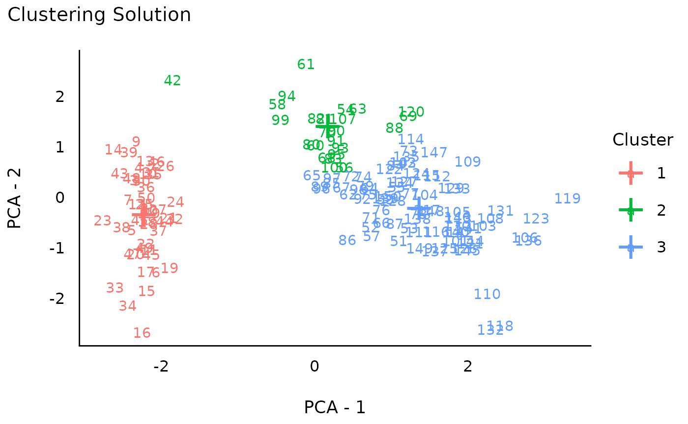
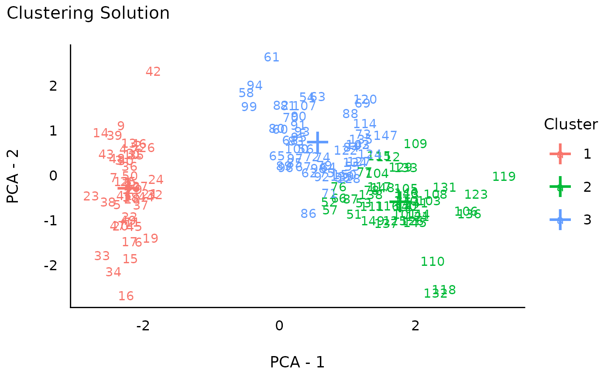
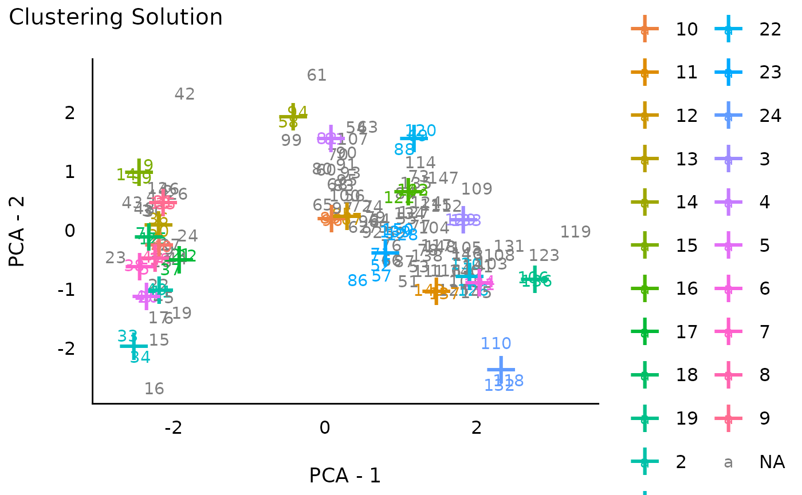
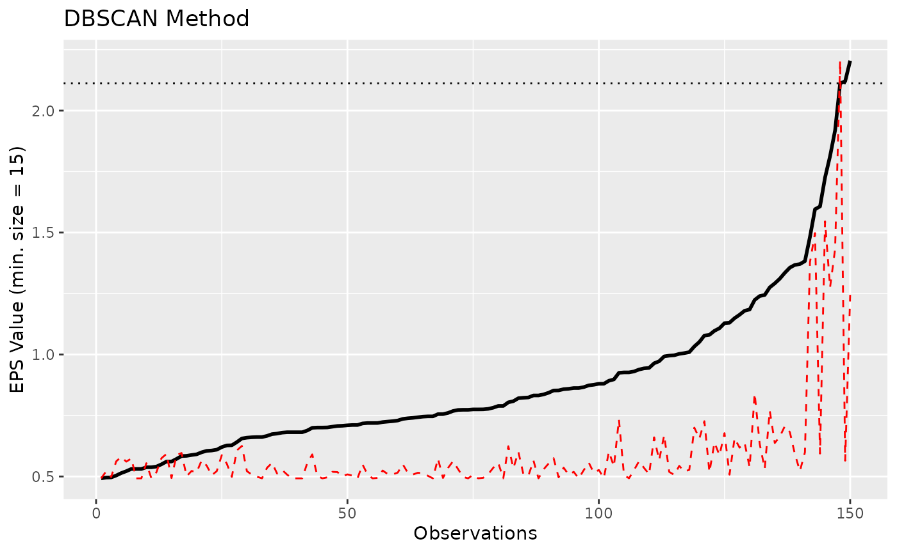
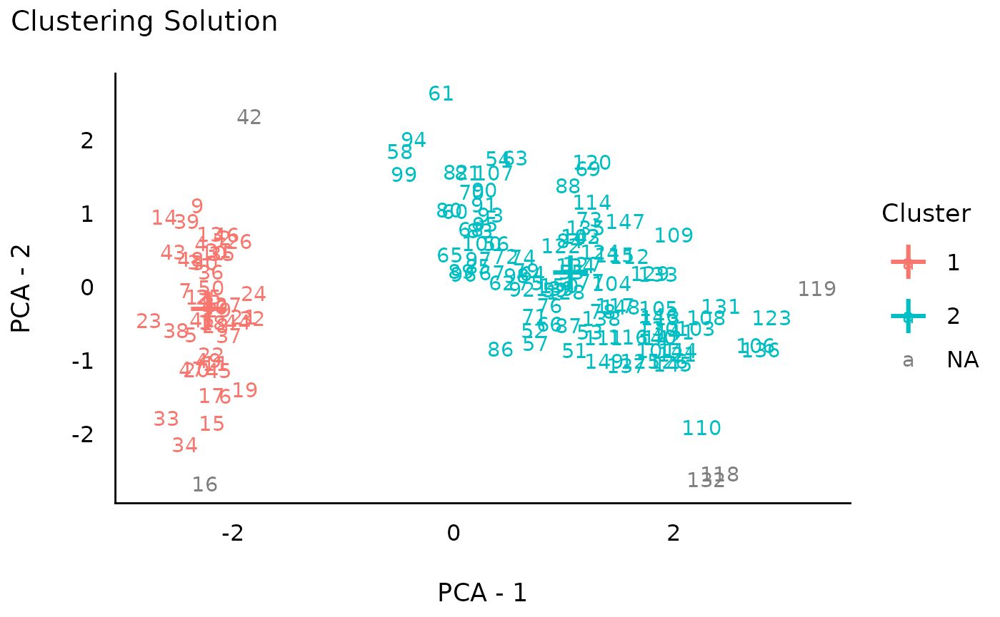
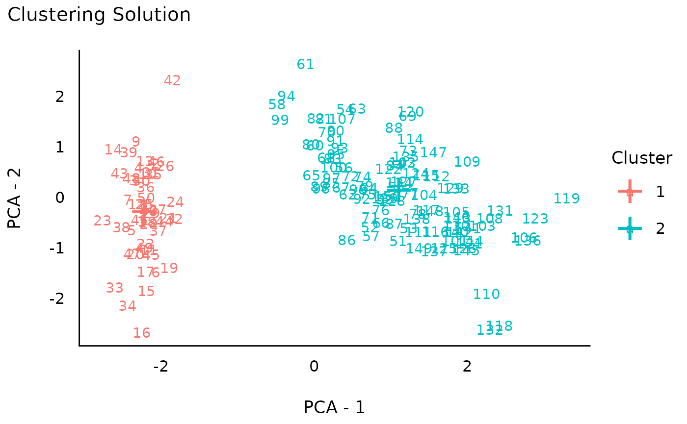
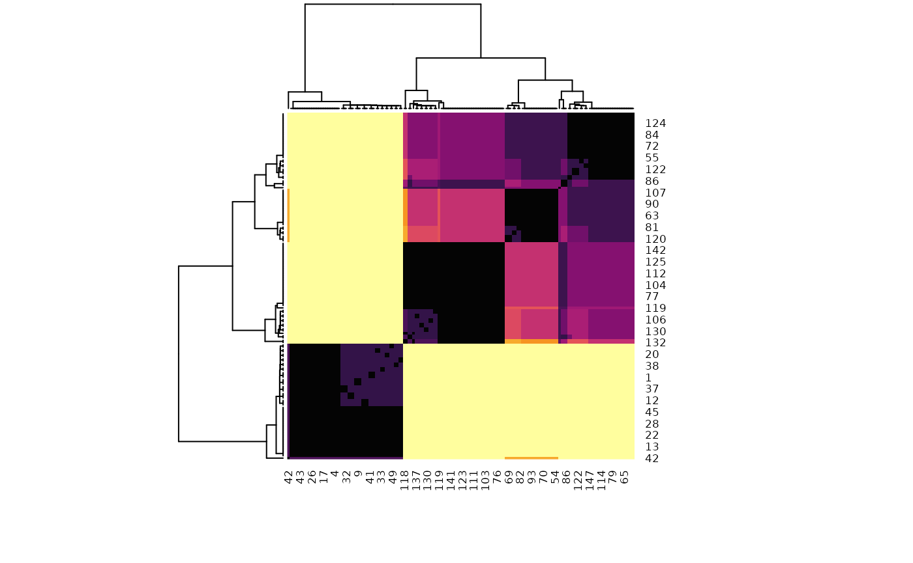

# Clustering with easystats

This vignette can be referred to by citing the package:

- Lüdecke, D., Ben-Shachar, M. S., Patil, I., & Makowski, D. (2020).
  *Extracting, computing and exploring the parameters of statistical
  models using R*. Journal of Open Source Software, 5(53), 2445.
  <https://doi.org/10.21105/joss.02445>

Note that in order to fully use all the methods demonstrated below, you
will need to additionally install the packages below:

``` r

install.packages(c("NbClust", "mclust", "pvclust", "cluster", "fpc", "dbscan"))
```

## Introduction

Clustering traditionally refers to the identification of groups of
observations (i.e., data rows). It differs from methods like [**PCA or
Factor
Analysis**](https://easystats.github.io/parameters/articles/efa_cfa.html),
which are usually applied on variables (i.e., columns). That said, it is
possible to *transpose* your data (columns become rows) to apply
clustering on variables.

There are many clustering algorithms (see [this for an
overview](https://scikit-learn.org/stable/modules/clustering.html)), but
they can grouped in two categories: **supervised** and **unsupervised**
techniques. In **supervised** techniques, you have to explicitly specify
[**how many
clusters**](https://easystats.github.io/parameters/reference/n_clusters.html)
you want to extract. **Unsupervised** techniques, on the other hand,
will estimate this number as part of their algorithm. Note that there
are no inherently superior and inferior clustering methods, each come
with their sets of limitations and benefits.

As an example in the tutorial below, we will use the **iris** dataset,
for which we know that there are 3 “real” clusters (the 3 Species of
flowers). Let’s first start with visualizing the 3 “real” clusters on a
2D space of the variables created through PCA.

``` r

library(ggplot2)
library(parameters)
library(see)

set.seed(33) # Set random seed

# Select the first 4 numeric columns (drop the Species fator)
data <- iris[1:4]
head(data) # Print the 6 first rows
#>   Sepal.Length Sepal.Width Petal.Length Petal.Width
#> 1          5.1         3.5          1.4         0.2
#> 2          4.9         3.0          1.4         0.2
#> 3          4.7         3.2          1.3         0.2
#> 4          4.6         3.1          1.5         0.2
#> 5          5.0         3.6          1.4         0.2
#> 6          5.4         3.9          1.7         0.4

# Run PCA
pca <- principal_components(data, n = 2)
pca_scores <- predict(pca, names = c("PCA_1", "PCA_2"))
pca_scores$True_Clusters <- iris$Species # Add real clusters

# Visualize
ggplot(pca_scores, aes(x = PCA_1, y = PCA_2, color = True_Clusters)) +
  geom_point() +
  theme_modern()
```



While the **setosa** species stands out quite clearly in this PCA space,
the separation between the two other species appear less clear cut.
Let’s see how data-driven clustering performs, and if we manage to
retrieve these 3 clusters.

## Supervised Clustering Methods

### How Many Clusters to Extract?

There is no easy answer to that important question. The best way is to
have strong expectations or hypotheses. If you don’t, well, researchers
have came up with data-driven solutions to estimate the optimal number
of clusters. The problem is that there are now a lot of these numerical
methods, and that they don’t always agree…

Because there is no clearly better method, we have implemented in
*easystats* a consensus-based algorithm that runs many of these methods,
and returns the number of clusters that is the most agreed upon.

``` r

n <- n_clusters(data, package = c("easystats", "NbClust", "mclust"))
n
#> # Method Agreement Procedure:
#> 
#> The choice of 2 clusters is supported by 15 (51.72%) methods out of 29 (Elbow, Silhouette, Gap_Maechler2012, Gap_Dudoit2002, Ch, DB, Duda, Pseudot2, Beale, Ratkowsky, PtBiserial, Mcclain, Dunn, SDindex, Mixture (VVV)).
plot(n)
```


As we can see, most methods suggest the existence of **2 clusters**,
followed by a **3-clusters** solution. It seems like the data does not
clearly discriminate between the 3 species of flowers. This discrepancy
between what is, and what we can recover from real-world data, is a
fundamental issue in data science.

### K-Means

We won’t go too much into details about the mathematics and intuition
behind these clustering methods, as good
[resources](https://scikit-learn.org/stable/modules/clustering.html) are
available all over the internet. Instead, we’ll focus on how to apply
them.

K-means is one of the most basic clustering algorithm, available in base
R through the [`kmeans()`](https://rdrr.io/r/stats/kmeans.html)
function. However, we provide in easystats a unified function to run
different clustering algorithms:
[**cluster_analysis()**](https://easystats.github.io/parameters/reference/cluster_analysis.html).
*(Note that k-means is a non-deterministic algorithm; running it
multiple times will result in different results!)*

Now that we know how many clusters we want to extract (let’s say that we
have a strong hypothesis on 3, which is partially supported by the
consensus method for estimating the optimal number of clusters).

``` r

rez_kmeans <- cluster_analysis(data, n = 3, method = "kmeans")

rez_kmeans # Show results
#> # Clustering Solution
#> 
#> The 3 clusters accounted for 76.70% of the total variance of the original data.
#> 
#> Cluster | n_Obs | Sum_Squares | Sepal.Length | Sepal.Width | Petal.Length | Petal.Width
#> ---------------------------------------------------------------------------------------
#> 1       |    53 |       44.09 |        -0.05 |       -0.88 |         0.35 |        0.28
#> 2       |    47 |       47.45 |         1.13 |        0.09 |         0.99 |        1.01
#> 3       |    50 |       47.35 |        -1.01 |        0.85 |        -1.30 |       -1.25
#> 
#> # Indices of model performance
#> 
#> Sum_Squares_Total | Sum_Squares_Between | Sum_Squares_Within |    R2
#> --------------------------------------------------------------------
#> 596               |             457.112 |            138.888 | 0.767
#> 
#> # You can access the predicted clusters via `predict()`.
```

Note that we can also visualize the **centers** (i.e., the “average” of
each variable for each cluster):

``` r

plot(summary(rez_kmeans)) # Visualize cluster centers
```


One can extract the cluster assignments to use it as a new variable by
using [`predict()`](https://rdrr.io/r/stats/predict.html).

``` r

predict(rez_kmeans) # Get clusters
#>   [1] 3 3 3 3 3 3 3 3 3 3 3 3 3 3 3 3 3 3 3 3 3 3 3 3 3 3 3 3 3 3 3 3 3 3 3 3 3
#>  [38] 3 3 3 3 3 3 3 3 3 3 3 3 3 2 2 2 1 1 1 2 1 1 1 1 1 1 1 1 2 1 1 1 1 2 1 1 1
#>  [75] 1 2 2 2 1 1 1 1 1 1 1 2 2 1 1 1 1 1 1 1 1 1 1 1 1 1 2 1 2 2 2 2 1 2 2 2 2
#> [112] 2 2 1 1 2 2 2 2 1 2 1 2 1 2 2 1 2 2 2 2 2 2 1 1 2 2 2 1 2 2 2 1 2 2 2 1 2
#> [149] 2 1
```

### Hierarchical Clustering

Hierarchical clustering is also a common clustering algorithm, available
in base R through the [`hclust()`](https://rdrr.io/r/stats/hclust.html)
function. This method is a bit different in the sense that is does not
straight up return clusters. Instead, in creates a hierarchical
structure (a *dendrogram*), a tree from which we can *cut* branches to
get a given number of clusters. Note that this “tree” cutting can be
done in an unsupervised fashion too using bootstrapping (which we will
apply in the next section).

``` r

rez_hclust <- cluster_analysis(data, n = 3, method = "hclust")

rez_hclust # Show results
#> # Clustering Solution
#> 
#> The 3 clusters accounted for 74.35% of the total variance of the original data.
#> 
#> Cluster | n_Obs | Sum_Squares | Sepal.Length | Sepal.Width | Petal.Length | Petal.Width
#> ---------------------------------------------------------------------------------------
#> 1       |    49 |       40.12 |        -1.00 |        0.90 |        -1.30 |       -1.25
#> 2       |    24 |       18.65 |        -0.40 |       -1.36 |         0.06 |       -0.04
#> 3       |    77 |       94.08 |         0.76 |       -0.15 |         0.81 |        0.81
#> 
#> # Indices of model performance
#> 
#> Sum_Squares_Total | Sum_Squares_Between | Sum_Squares_Within |    R2
#> --------------------------------------------------------------------
#> 596               |             443.143 |            152.857 | 0.744
#> 
#> # You can access the predicted clusters via `predict()`.

# Visualize
plot(rez_hclust) + theme_modern() # Visualize
```



### Hierarchical K-Means

Hierarchical K-Means, as its name suggest, is essentially a combination
of K-Means and hierarchical clustering that aims at improving the
stability and robustness of the results.

``` r

rez_hkmeans <- cluster_analysis(data, n = 3, method = "hkmeans")

rez_hkmeans # Show results
#> # Clustering Solution
#> 
#> The 3 clusters accounted for 76.70% of the total variance of the original data.
#> 
#> Cluster | n_Obs | Sum_Squares | Sepal.Length | Sepal.Width | Petal.Length | Petal.Width
#> ---------------------------------------------------------------------------------------
#> 1       |    50 |       47.35 |        -1.01 |        0.85 |        -1.30 |       -1.25
#> 2       |    53 |       44.09 |        -0.05 |       -0.88 |         0.35 |        0.28
#> 3       |    47 |       47.45 |         1.13 |        0.09 |         0.99 |        1.01
#> 
#> # Indices of model performance
#> 
#> Sum_Squares_Total | Sum_Squares_Between | Sum_Squares_Within |    R2
#> --------------------------------------------------------------------
#> 596               |             457.112 |            138.888 | 0.767
#> 
#> # You can access the predicted clusters via `predict()`.
```

### K-Medoids (PAM)

Clustering around “medoids”, instead of “centroid”, is considered to be
a more robust version of K-means. See
[`cluster::pam()`](https://rdrr.io/pkg/cluster/man/pam.html) for more
information.

``` r

rez_pam <- cluster_analysis(data, n = 3, method = "pam")

rez_pam # Show results
#> # Clustering Solution
#> 
#> The 3 clusters accounted for 76.46% of the total variance of the original data.
#> 
#> Cluster | n_Obs | Sum_Squares | Sepal.Length | Sepal.Width | Petal.Length | Petal.Width
#> ---------------------------------------------------------------------------------------
#> 1       |    50 |       47.35 |        -1.01 |        0.85 |        -1.30 |       -1.25
#> 2       |    45 |       45.26 |         1.17 |        0.06 |         1.02 |        1.05
#> 3       |    55 |       47.67 |        -0.04 |       -0.82 |         0.35 |        0.28
#> 
#> # Indices of model performance
#> 
#> Sum_Squares_Total | Sum_Squares_Between | Sum_Squares_Within |    R2
#> --------------------------------------------------------------------
#> 596               |             455.714 |            140.286 | 0.765
#> 
#> # You can access the predicted clusters via `predict()`.

# Visualize
plot(rez_pam) + theme_modern() # Visualize
```



## Unsupervised Clustering Methods

Unsupervised clustering methods estimate the optimal number of clusters
themselves (hence, `n = NULL` as we don’t pre-specify a given number of
clusters). Note that unsupervised methods can sometimes identify
observations that do not fit under any clusters (i.e., **“outliers”**).
They will be classified as belonging to the cluster “0” (which is not a
real cluster, but rather groups all the outliers).

### Bootstrapped Hierarchical Clustering

This method computes p-values for each cluster of the hierarchical
cluster structure, and returns the **significant** clusters. This method
can return a larger number of smaller clusters and, because it’s based
on bootstrapping, is quite slow.

``` r

rez_hclust2 <- cluster_analysis(data,
  n = NULL,
  method = "hclust",
  iterations = 500,
  ci = 0.90
)

rez_hclust2 # Show results
#> # Clustering Solution
#> 
#> The 25 clusters accounted for 48.37% of the total variance of the original data.
#> 
#> Cluster | n_Obs | Sum_Squares | Sepal.Length | Sepal.Width | Petal.Length | Petal.Width
#> ---------------------------------------------------------------------------------------
#> 0       |    89 |      304.31 |         0.11 |       -0.19 |         0.12 |        0.12
#> 1       |     2 |    7.29e-03 |        -0.96 |        0.79 |        -1.28 |       -1.31
#> 10      |     2 |        0.02 |        -0.23 |       -0.13 |         0.22 |        0.07
#> 11      |     2 |        0.02 |         0.49 |        0.79 |         0.99 |        1.51
#> 12      |     2 |        0.03 |        -0.41 |       -0.13 |         0.42 |        0.39
#> 13      |     2 |        0.03 |        -1.02 |        0.44 |        -1.39 |       -1.31
#> 14      |     2 |        0.03 |        -1.08 |       -1.62 |        -0.26 |       -0.26
#> 15      |     3 |        0.07 |        -1.78 |       -0.21 |        -1.41 |       -1.35
#> 16      |     3 |        0.09 |        -0.13 |       -0.74 |         0.72 |        0.96
#> 17      |     3 |        0.12 |        -0.50 |        0.86 |        -1.28 |       -1.22
#> 18      |     3 |        0.09 |        -1.34 |        0.79 |        -1.20 |       -1.27
#> 19      |     2 |        0.08 |         2.18 |       -0.13 |         1.47 |        1.31
#> 2       |     2 |    7.29e-03 |        -0.60 |        1.47 |        -1.28 |       -1.31
#> 20      |     2 |        0.10 |        -0.60 |        2.51 |        -1.31 |       -1.38
#> 21      |     2 |        0.15 |         1.64 |        0.10 |         1.21 |        0.66
#> 22      |     3 |        0.22 |         0.39 |       -1.89 |         0.50 |        0.31
#> 23      |     7 |        1.42 |         0.29 |        0.23 |         0.57 |        0.66
#> 24      |     3 |        0.80 |         2.12 |        1.55 |         1.50 |        1.36
#> 3       |     2 |    8.61e-03 |         0.67 |       -0.59 |         1.04 |        1.25
#> 4       |     2 |        0.01 |        -0.41 |       -1.51 |    -4.53e-03 |       -0.20
#> 5       |     2 |        0.01 |        -0.90 |        1.70 |        -1.25 |       -1.25
#> 6       |     2 |        0.01 |         1.22 |        0.33 |         1.16 |        1.44
#> 7       |     2 |        0.02 |        -1.08 |        1.25 |        -1.34 |       -1.38
#> 8       |     3 |        0.02 |        -0.94 |        1.02 |        -1.35 |       -1.22
#> 9       |     3 |        0.02 |        -1.18 |        0.10 |        -1.26 |       -1.35
#> 
#> # Indices of model performance
#> 
#> Sum_Squares_Total | Sum_Squares_Between | Sum_Squares_Within |    R2
#> --------------------------------------------------------------------
#> 596               |             288.295 |              3.390 | 0.484
#> 
#> # You can access the predicted clusters via `predict()`.
plot(rez_hclust2) + theme_modern() # Visualize
```



### DBSCAN

Although the DBSCAN method is quite powerful to identify clusters, it is
highly dependent on its parameters, namely, `eps` and the `min_size`.
Regarding the latter, the minimum size of any cluster is set by default
to `0.1` (i.e., 10% of rows), which is appropriate to avoid having too
small clusters.

The “optimal” **eps** value can be estimated using the
[`n_clusters_dbscan()`](https://easystats.github.io/parameters/reference/cluster_analysis.html)
function:

``` r

eps <- n_clusters_dbscan(data, min_size = 0.1)
eps
#> The DBSCAN method, based on the total clusters sum of squares, suggests that the optimal eps = 2.11193281281293 (with min. cluster size set to 15), which corresponds to 1 clusters.
plot(eps)
```



It seems like the numeric method to find the elbow of the curve doesn’t
work well, and returns a value that is too high. Based on visual
assessment, the elbow seems to be located around `eps = 1.45`.

``` r

rez_dbscan <- cluster_analysis(data, method = "dbscan", dbscan_eps = 1.45)

rez_dbscan # Show results
#> # Clustering Solution
#> 
#> The 3 clusters accounted for 61.14% of the total variance of the original data.
#> 
#> Cluster | n_Obs | Sum_Squares | Sepal.Length | Sepal.Width | Petal.Length | Petal.Width
#> ---------------------------------------------------------------------------------------
#> 0       |     5 |       47.84 |         1.03 |        0.74 |         0.45 |        0.32
#> 1       |    48 |       34.54 |        -1.02 |        0.86 |        -1.30 |       -1.26
#> 2       |    97 |      149.21 |         0.45 |       -0.46 |         0.62 |        0.61
#> 
#> # Indices of model performance
#> 
#> Sum_Squares_Total | Sum_Squares_Between | Sum_Squares_Within |    R2
#> --------------------------------------------------------------------
#> 596               |             364.406 |            183.751 | 0.611
#> 
#> # You can access the predicted clusters via `predict()`.
plot(rez_dbscan) + theme_modern() # Visualize
```



### Hierarchical K-Means

Hierarchical DBSCAN is a variant that does not require the critical
**EPS** argument. It computes the hierarchy of all DBSCAN solutions, and
then finds the optimal cuts in the hierarchy using a stability-based
extraction method.

``` r

rez_hdbscan <- cluster_analysis(data, method = "hdbscan")

rez_hdbscan # Show results
#> # Clustering Solution
#> 
#> The 3 clusters accounted for 66.08% of the total variance of the original data.
#> 
#> Cluster | n_Obs | Sum_Squares | Sepal.Length | Sepal.Width | Petal.Length | Petal.Width
#> ---------------------------------------------------------------------------------------
#> 0       |     2 |        0.08 |         2.36 |        1.70 |         1.58 |        1.18
#> 1       |    98 |      154.76 |         0.47 |       -0.47 |         0.63 |        0.61
#> 2       |    50 |       47.35 |        -1.01 |        0.85 |        -1.30 |       -1.25
#> 
#> # Indices of model performance
#> 
#> Sum_Squares_Total | Sum_Squares_Between | Sum_Squares_Within |    R2
#> --------------------------------------------------------------------
#> 596               |             393.813 |            202.108 | 0.661
#> 
#> # You can access the predicted clusters via `predict()`.

# Visualize
plot(rez_hdbscan) + theme_modern() # Visualize
```


### K-Medoids with estimation of number of clusters (pamk)

This is K-Medoids with an integrated estimation of the number of
clusters. See [`fpc::pamk`](https://rdrr.io/pkg/fpc/man/pamk.html) for
more details.

``` r

rez_pamk <- cluster_analysis(data, method = "pamk")

rez_pamk # Show results
#> # Clustering Solution
#> 
#> The 2 clusters accounted for 62.94% of the total variance of the original data.
#> 
#> Cluster | n_Obs | Sum_Squares | Sepal.Length | Sepal.Width | Petal.Length | Petal.Width
#> ---------------------------------------------------------------------------------------
#> 1       |    50 |       47.35 |        -1.01 |        0.85 |        -1.30 |       -1.25
#> 2       |   100 |      173.53 |         0.51 |       -0.43 |         0.65 |        0.63
#> 
#> # Indices of model performance
#> 
#> Sum_Squares_Total | Sum_Squares_Between | Sum_Squares_Within |    R2
#> --------------------------------------------------------------------
#> 596               |             375.121 |            220.879 | 0.629
#> 
#> # You can access the predicted clusters via `predict()`.

# Visualize
plot(rez_pamk) + theme_modern() # Visualize
```


### Mixture

Model-based clustering based on finite Gaussian mixture models. Models
are estimated by EM algorithm initialized by hierarchical model-based
agglomerative clustering. The optimal model is then selected according
to BIC.

``` r

library(mclust)

rez_mixture <- cluster_analysis(data, method = "mixture")

rez_mixture # Show results
#> # Clustering Solution
#> 
#> The 2 clusters accounted for 62.94% of the total variance of the original data.
#> 
#> Cluster | n_Obs | Sum_Squares | Sepal.Length | Sepal.Width | Petal.Length | Petal.Width
#> ---------------------------------------------------------------------------------------
#> 1       |    50 |       47.35 |        -1.01 |        0.85 |        -1.30 |       -1.25
#> 2       |   100 |      173.53 |         0.51 |       -0.43 |         0.65 |        0.63
#> 
#> # Indices of model performance
#> 
#> Sum_Squares_Total | Sum_Squares_Between | Sum_Squares_Within |    R2
#> --------------------------------------------------------------------
#> 596               |             375.121 |            220.879 | 0.629
#> 
#> # You can access the predicted clusters via `predict()`.

# Visualize
plot(rez_mixture) + theme_modern() # Visualize
```



## Metaclustering

One of the core “issue” of statistical clustering is that, in many
cases, different methods will give different results. The
**metaclustering** approach proposed by *easystats* (that finds echoes
in *consensus clustering*; see Monti et al., 2003) consists of treating
the unique clustering solutions as a ensemble, from which we can derive
a probability matrix. This matrix contains, for each pair of
observations, the probability of being in the same cluster. For
instance, if the 6th and the 9th row of a dataframe has been assigned to
a similar cluster by 5 our of 10 clustering methods, then its
probability of being grouped together is 0.5.

Metaclustering is based on the hypothesis that, as each clustering
algorithm embodies a different prism by which it sees the data, running
an infinite amount of algorithms would result in the emergence of the
“true” clusters. As the number of algorithms and parameters is finite,
the probabilistic perspective is a useful proxy. This method is
interesting where there is no obvious reasons to prefer one over another
clustering method, as well as to investigate how robust some clusters
are under different algorithms.

``` r

list_of_results <- list(
  rez_kmeans, rez_hclust, rez_hkmeans, rez_pam,
  rez_hclust2, rez_dbscan, rez_hdbscan, rez_mixture
)

probability_matrix <- cluster_meta(list_of_results)

# Plot the matrix as a reordered heatmap
heatmap(probability_matrix,
  scale = "none",
  col = grDevices::hcl.colors(256, palette = "inferno")
)
```



The dendrogram (which is a **hierarchical clustering of the clustering
solution**, hence the name of **meta**clustering), as well as the
heatmap (in which the darker squares represent a higher probability of
belonging to the same cluster) shows that there is one metacluster
consisting of the 1-50 first rows (bottom left), and then the rest of
the observations are closer to one another. However, two subclusters are
still visible, corresponding to the “true” species.

The metaclustering approach confirms our initial hypothesis, *the
**setosa** species stands out quite clearly, and the separation between
the two other species is less clear cut*.

## Resources

- [Clustering algorithms
  overview](https://scikit-learn.org/stable/modules/clustering.html)
- [Density-based
  Clustering](https://www.datanovia.com/en/lessons/dbscan-density-based-clustering-essentials/)
