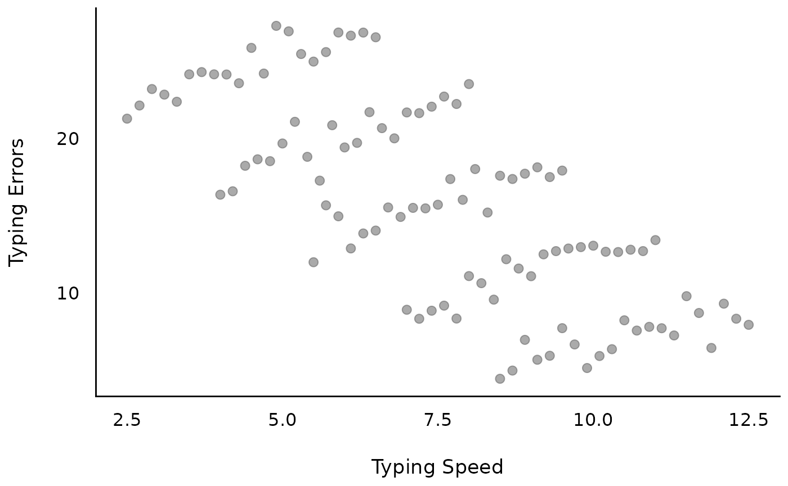
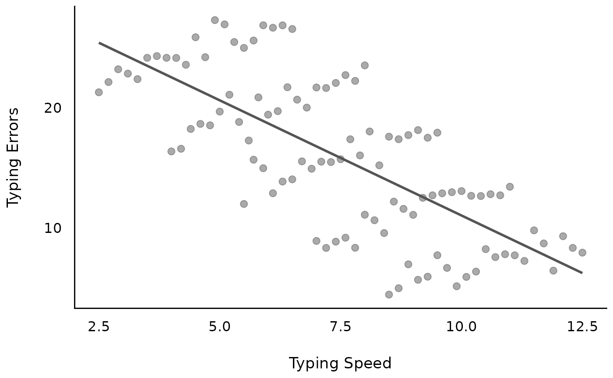
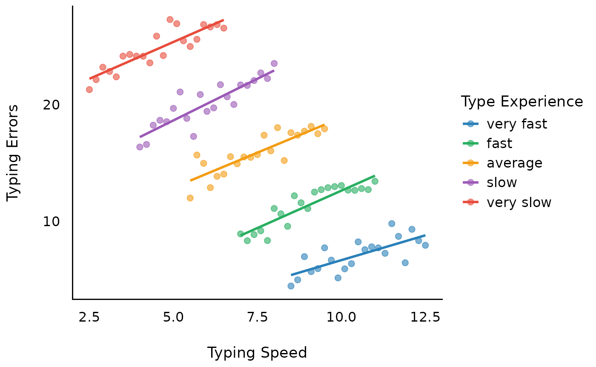
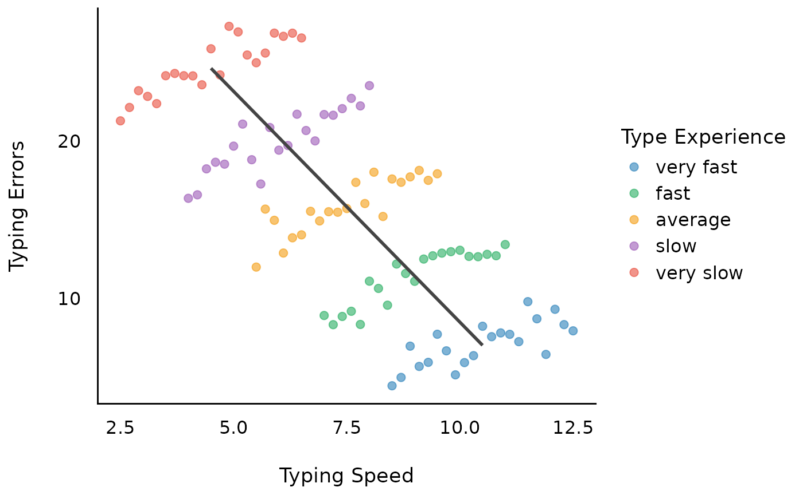

# Analysing Longitudinal or Panel Data

This vignette explains the rational behind the
[`demean()`](https://easystats.github.io/datawizard/reference/demean.html)
function.

We give recommendations how to analyze multilevel or hierarchical data
structures, when macro-indicators (or level-2 predictors, or
higher-level units, or more general: *group-level predictors*) are used
as covariates and the model suffers from **heterogeneity bias** (Bell
and Jones 2015).

## Sample data used in this vignette

``` r

library(parameters)
data("qol_cancer")
```

- Variables:

  - `QoL` : Response (quality of life of patient)

  - `phq4` : Patient Health Questionnaire, **time-varying** variable

  - `hospital` : Location of treatment, **time-invariant** variable,
    co-variate

  - `education`: Educational level, **time-invariant** variable,
    co-variate

  - `ID` : patient ID

  - `time` : time-point of measurement

## Heterogeneity bias

Heterogeneity bias occurs when group-level predictors vary within and
across groups, and hence fixed effects may correlate with group (or
random) effects. This is a typical situation when analyzing longitudinal
or panel data: Due to the repeated measurements of persons, the “person”
(or subject-ID) is now a level-2 variable. Predictors at level-1 (“fixed
effects”), e.g. self-rated health or income, now have an effect at
level-1 (“within”-effect) and at higher-level units (level-2, the
subject-level, which is the “between”-effect) (see also [this
posting](https://shouldbewriting.netlify.app/posts/2019-10-21-accounting-for-within-and-between-subject-effect/)).
This inevitably leads to correlating fixed effects and error terms -
which, in turn, results in biased estimates, because both the within-
*and* between-effect are captured in *one* estimate.

You can check if your model may suffer from heterogeneity bias using the
[`check_group_variation()`](https://easystats.github.io/performance/reference/check_group_variation.html)
function:

``` r

library(performance)
check_group_variation(qol_cancer, select = c("phq4", "education"), by = "ID")
#> Check ID variation
#> 
#> Variable  | Variation | Design
#> ------------------------------
#> phq4      |      both |       
#> education |   between |
```

## Adressing heterogeneity bias: the Fixed Effects Regression (FE) approach

Fixed effects regression models (FE) are a popular approach for panel
data analysis in particular in econometrics and considered as gold
standard. To avoid the problem of heterogeneity bias, in FE all
higher-level variance (and thus, any between-effects), “are controlled
out using the higher-level entities themselves, included in the model as
dummy variables” (Bell and Jones 2015). As a consequence, FE models are
only able estimate *within-effects*.

To remove between-effects and only model within-effects, the data needs
some preparation: *de-meaning*. De-meaning, or *person-mean centering*,
or *centering within clusters*, takes away the higher-level mean from
the regression equation, and as such, FE avoids estimating a parameter
for each higher-level unit.

### Computing the de-meaned and group-meaned variables

``` r

qol_cancer <- datawizard::demean(qol_cancer, select = c("phq4", "QoL"), by = "ID")
```

Now we have:

- `phq4_between`: time-varying variable with the mean of `phq4` across
  all time-points, for each patient (ID).

- `phq4_within`: the de-meaned time-varying variable `phq4`.

A FE model is a classical linear model, where

- Intercept is removed

- time-invariant predictors are not allowed to be included

- the group-level factor is included as predictor

- time-varying predictors are de-meaned (“person-mean centered”,
  indicating the “within-subject” effect)

``` r

fe_model1 <- lm(
  QoL ~ 0 + time + phq4_within + ID,
  data = qol_cancer
)
# we use only the first two rows, because the remaining rows are
# the estimates for "ID", which is not of interest here...
model_parameters(fe_model1)[1:2, ]
#> Parameter   | Coefficient |   SE |         95% CI | t(374) |      p
#> -------------------------------------------------------------------
#> time        |        1.09 | 0.64 | [-0.17,  2.34] |   1.70 | 0.089 
#> phq4 within |       -3.66 | 0.41 | [-4.46, -2.86] |  -8.95 | < .001


# instead of removing the intercept, we could also use the
# de-meaned response...
fe_model2 <- lm(
  QoL_within ~ time + phq4_within + ID,
  data = qol_cancer
)
model_parameters(fe_model2)[2:3, ]
#> Parameter   | Coefficient |   SE |         95% CI | t(374) |      p
#> -------------------------------------------------------------------
#> time        |        1.09 | 0.64 | [-0.17,  2.34] |   1.70 | 0.089 
#> phq4 within |       -3.66 | 0.41 | [-4.46, -2.86] |  -8.95 | < .001

# we compare the results with those from the "lfe"-package for panel data
library(lfe)
fe_model3 <- felm(
  QoL ~ time + phq4 | ID,
  data = qol_cancer
)
model_parameters(fe_model3)
#> # Fixed Effects
#> 
#> Parameter | Coefficient |   SE |         95% CI | t(374) |      p
#> -----------------------------------------------------------------
#> time      |        1.09 | 0.64 | [-0.17,  2.34] |   1.70 | 0.089 
#> phq4      |       -3.66 | 0.41 | [-4.46, -2.86] |  -8.95 | < .001
```

As we can see, the *within-effect* of PHQ-4 is `-3.66`, hence the mean
of the change for an average individual case in our sample (or, the
“net” effect), is `-3.66`.

But what about the between-effect? How do people with higher PHQ-4 score
differ from people with lower PHQ-4 score? Or what about educational
inequalities? Do higher educated people have a higher PHQ-4 score than
lower educated people?

This question cannot be answered with FE regression. But: “Can one fit a
multilevel model with varying intercepts (or coefficients) when the
units and predictors correlate? The answer is yes. And the solution is
simple.” (Bafumi and Gelman 2006)

## Adressing heterogeneity bias: the Mixed Model approach

Mixed models include different levels of sources of variability
(i.e. error terms at each level). Predictors used at level-1 that are
varying across higher-level units will thus have residual errors at both
level-1 and higher-level units. “Such covariates contain two parts: one
that is specific to the higher-level entity that does not vary between
occasions, and one that represents the difference between occasions,
within higher-level entities” (Bell and Jones 2015). Hence, the error
terms will be correlated with the covariate, which violates one of the
assumptions of mixed models (iid, independent and identically
distributed error terms) - also known and described above as
*heterogeneity bias*.

But how can this issue be addressed outside the FE framework?

There are several ways how to address this using a mixed models
approach:

- Correlated group factors and predictors are no problem anyway, because
  [partial
  pooling](https://www.tjmahr.com/plotting-partial-pooling-in-mixed-effects-models/)
  allows estimates of units o borrow strength from the whole sample and
  shrink toward a common mean (Shor et al. (2007)).

- If predictor and group factors correlate, one can remove this
  correlation by group-meaning (or “mean within clusters,” Bafumi and
  Gelman 2006; Gelman and Hill 2007, 12.6.).

- When time-varying predictors are “decomposed” into their time-varying
  and time-invariant components (de-meaning), then mixed models can
  model **both** within- and between-subject effects (Bell et
  al. 2019) - this approach is essentially a further development of a
  long-known recommendation by Mundlak (Mundlak 1978).

For now, we will follow the last recommendation and use the within- and
between-version of `phq4`.

``` r

library(lme4)
mixed_1 <- lmer(
  QoL ~ time + phq4_within + phq4_between + (1 | ID),
  data = qol_cancer
)
model_parameters(mixed_1)
#> # Fixed Effects
#> 
#> Parameter    | Coefficient |   SE |         95% CI | t(558) |      p
#> --------------------------------------------------------------------
#> (Intercept)  |       71.53 | 1.56 | [68.48, 74.59] |  45.98 | < .001
#> time         |        1.09 | 0.64 | [-0.17,  2.34] |   1.70 | 0.089 
#> phq4 within  |       -3.66 | 0.41 | [-4.46, -2.86] |  -8.95 | < .001
#> phq4 between |       -6.28 | 0.50 | [-7.27, -5.30] | -12.53 | < .001
#> 
#> # Random Effects
#> 
#> Parameter          | Coefficient |   SE |         95% CI
#> --------------------------------------------------------
#> SD (Intercept: ID) |        9.88 | 0.80 | [ 8.43, 11.58]
#> SD (Residual)      |       12.37 | 0.45 | [11.51, 13.28]

# compare to FE-model
model_parameters(fe_model1)[1:2, ]
#> Parameter   | Coefficient |   SE |         95% CI | t(374) |      p
#> -------------------------------------------------------------------
#> time        |        1.09 | 0.64 | [-0.17,  2.34] |   1.70 | 0.089 
#> phq4 within |       -3.66 | 0.41 | [-4.46, -2.86] |  -8.95 | < .001
```

As we can see, the estimates and standard errors are identical. The
argument *against* the use of mixed models, i.e. that using mixed models
for panel data will yield biased estimates and standard errors, is based
on an incorrect model specification (Mundlak 1978). As such, when the
(mixed) model is properly specified, the estimator of the mixed model is
identical to the ‘within’ (i.e. FE) estimator.

As a consequence, we cannot only use the above specified mixed model for
panel data, we can even specify more complex models including
within-effects, between-effects or random effects variation. A mixed
models approach can model the causes of endogeneity explicitly by
including the (separated) within- and between-effects of time-varying
fixed effects and including time-constant fixed effects.

``` r

mixed_2 <- lmer(
  QoL ~ time + phq4_within + phq4_between + education + (1 + time | ID),
  data = qol_cancer
)
# effects = "fixed" will not display random effects, but split the
# fixed effects into its between- and within-effects components.
model_parameters(mixed_2, effects = "fixed")
#> # Fixed Effects
#> 
#> Parameter        | Coefficient |   SE |         95% CI | t(554) |      p
#> ------------------------------------------------------------------------
#> (Intercept)      |       67.36 | 2.48 | [62.48, 72.23] |  27.15 | < .001
#> time             |        1.09 | 0.66 | [-0.21,  2.39] |   1.65 | 0.099 
#> phq4 within      |       -3.72 | 0.41 | [-4.52, -2.92] |  -9.10 | < .001
#> phq4 between     |       -6.13 | 0.52 | [-7.14, -5.11] | -11.84 | < .001
#> education [mid]  |        5.01 | 2.35 | [ 0.40,  9.62] |   2.14 | 0.033 
#> education [high] |        5.52 | 2.75 | [ 0.11, 10.93] |   2.00 | 0.046
```

For more complex models, within-effects will naturally change slightly
and are no longer identical to simpler FE models. This is no “bias”, but
rather the result of building more complex models: FE models lack
information of variation in the group-effects or between-subject
effects. Furthermore, FE models cannot include random slopes, which
means that fixed effects regressions are neglecting “cross-cluster
differences in the effects of lower-level controls (which) reduces the
precision of estimated context effects, resulting in (…) low statistical
power” (Heisig et al. 2017).

## Conclusion: Complex Random Effects Within-Between Models

Depending on the structure of the data, the best approach to analyzing
panel data would be a so called “complex random effects within-between”
model (Bell et al. 2019):

y_(it) = β₀ + β_(1W) (x_(it) - ͞x_(i)) + β_(2B) ͞x_(i) + β₃ z_(i) +
υ_(i0) + υ_(i1) (x_(it) - ͞x_(i)) + ε_(it)

- x_(it) - ͞x_(i) is the de-meaned predictor, *phq4_within*
- ͞x_(i) is the group-meaned predictor, *phq4_between*
- β_(1W) is the coefficient for phq4_within (within-subject)
- β_(2B) is the coefficient for phq4_between (bewteen-subject)
- β₃ is the coefficient for time-constant predictors, such as `hospital`
  or `education` (bewteen-subject)

In R-code, the model is written down like this:

``` r

# We ignore the convergence warnings for now...
rewb <- suppressWarnings(lmer(
  QoL ~ time + phq4_within + phq4_between + education +
    (1 + time | ID) + (1 + phq4_within | ID),
  data = qol_cancer
))
```

**What about time-constant predictors?**

After de-meaning time-varying predictors, “at the higher level, the mean
term is no longer constrained by Level 1 effects, so it is free to
account for all the higher-level variance associated with that variable”
(Bell and Jones 2015).

Thus, *time-constant **categorical*** predictors, that only have a
between-effect, can be simply included as fixed effects predictor (since
they’re not constrained by level-1 effects). Time-constant *continuous*
**group-level predictors** (for instance, GDP of countries) should be
group-meaned, to have a proper “between”-effect (Gelman and Hill 2007,
12.6.).

The benefit of this kind of model is that you have information on
within-, between- and other time-constant (i.e. between) effects or
group-level predictors…

``` r

model_parameters(rewb, effects = "fixed")
#> # Fixed Effects
#> 
#> Parameter        | Coefficient |   SE |         95% CI | t(551) |      p
#> ------------------------------------------------------------------------
#> (Intercept)      |       67.18 | 2.39 | [62.49, 71.87] |  28.13 | < .001
#> time             |        1.18 | 0.60 | [-0.01,  2.37] |   1.95 | 0.051 
#> phq4 within      |       -4.50 | 0.58 | [-5.64, -3.36] |  -7.78 | < .001
#> phq4 between     |       -6.11 | 0.52 | [-7.13, -5.10] | -11.81 | < .001
#> education [mid]  |        4.95 | 2.35 | [ 0.34,  9.56] |   2.11 | 0.035 
#> education [high] |        5.62 | 2.76 | [ 0.20, 11.04] |   2.04 | 0.042
```

… but you can also model the variation of (group) effects across time
(and probably space), and you can even include more higher-level units
(e.g. nested design or cross-classified design with more than two
levels):

``` r

random_parameters(rewb)
#> # Random Effects
#> 
#> Within-Group Variance              119.51 (10.93)
#> Between-Group Variance
#>   Random Intercept (ID)            111.26 (10.55)
#>   Random Intercept (ID.1)           21.86  (4.68)
#>   Random Slope (ID.time)             0.46  (0.68)
#>   Random Slope (ID.1.phq4_within)   14.37  (3.79)
#> Correlations
#>   ID.time                              -1
#>   ID.phq4_within                     0.48
#> N (groups per factor)
#>   ID                                  188
#> Observations                          564
```

**What about imbalanced groups, i.e. large differences in N per group?**

See little example after this visual example…

## A visual example

First, we generate some fake data that implies a linear relationship
between outcome and independent variable. The objective is that the
amount of typing errors depends on how fast (typing speed) you can type,
however, the more typing experience you have, the faster you can type.
Thus, the outcome measure is “amount of typing errors”, while our
predictor is “typing speed”. Furthermore, we have repeated measurements
of people with different “typing experience levels”.

The results show that we will have two sources of variation: Overall,
more experienced typists make less mistakes (group-level pattern). When
typing faster, typists make more mistakes (individual-level pattern).

``` r

library(ggplot2)
library(see)

set.seed(123)
n <- 5
b <- seq(1, 1.5, length.out = 5)
x <- seq(2, 2 * n, 2)

d <- do.call(rbind, lapply(1:n, function(i) {
  data.frame(
    x = seq(1, n, by = 0.2),
    y = 2 * x[i] + b[i] * seq(1, n, by = 0.2) + rnorm(21),
    grp = as.factor(2 * i)
  )
}))

d <- d |>
  datawizard::data_group(grp) |>
  datawizard::data_modify(x = rev(15 - (x + 1.5 * as.numeric(grp)))) |>
  datawizard::data_ungroup()

labs <- c("very slow", "slow", "average", "fast", "very fast")
levels(d$grp) <- rev(labs)

d <- datawizard::demean(d, c("x", "y"), by = "grp")
```

Let’s look at the raw data…



### Model 1: Linear relationship between typing errors and typing speed

We can now assume a (linear) relationship between typing errors and
typing speed.



Looking at the coefficients, we have following model with a coefficient
of `-1.92`.

``` r

m1 <- lm(y ~ x, data = d)
model_parameters(m1)
#> Parameter   | Coefficient |   SE |         95% CI | t(103) |      p
#> -------------------------------------------------------------------
#> (Intercept) |       30.20 | 1.42 | [27.39, 33.00] |  21.34 | < .001
#> x           |       -1.92 | 0.18 | [-2.27, -1.56] | -10.69 | < .001
```

However, we have ignored the clustered structure in our data, in this
example due to repeated measurements.


### Model 2: Within-subject effect of typing speed

A fixed effects regression (FE-regression) would now remove all
between-effects and include only the within-effects as well as the
group-level indicator.



This returns the coefficient of the “within”-effect, which is `1.2`,
with a standard error of `0.07`. Note that the FE-model does *not* take
the variation *between* subjects into account, thus resulting in
(possibly) biased estimates, and biased standard errors.

``` r

m2 <- lm(y ~ 0 + x_within + grp, data = d)
model_parameters(m2)[1, ]
#> Parameter | Coefficient |   SE |       95% CI | t(99) |      p
#> --------------------------------------------------------------
#> x within  |        1.20 | 0.07 | [1.06, 1.35] | 16.08 | < .001
```

### Model 3: Between-subject effect of typing speed

To understand, why the above model 1 (`m1`) returns a biased estimate,
which is a “weighted average” of the within- and between-effects, let us
look at the between-effect now.



As we can see, the between-effect is `-2.93`, which is different from
the `-1.92` estimated in the model `m1`.

``` r

m3 <- lm(y ~ x_between, data = d)
model_parameters(m3)
#> Parameter   | Coefficient |   SE |         95% CI | t(103) |      p
#> -------------------------------------------------------------------
#> (Intercept) |       37.83 | 0.62 | [36.59, 39.06] |  60.79 | < .001
#> x between   |       -2.93 | 0.08 | [-3.09, -2.78] | -36.76 | < .001
```

### Model 4: Mixed model with within- and between-subjects

Since FE-models can only model within-effects, we now use a mixed model
with within- and between-effects.


We see, the estimate for the within-effects is *not* biased.
Furthermore, we get the correct between-effect as well (standard errors
differ, because the variance in the grouping structure is more
accurately taken into account).

``` r

m4 <- lmer(y ~ x_between + x_within + (1 | grp), data = d)
model_parameters(m4)
#> # Fixed Effects
#> 
#> Parameter   | Coefficient |   SE |         95% CI | t(100) |      p
#> -------------------------------------------------------------------
#> (Intercept) |       37.83 | 0.33 | [37.17, 38.48] | 114.46 | < .001
#> x between   |       -2.93 | 0.04 | [-3.02, -2.85] | -69.22 | < .001
#> x within    |        1.20 | 0.07 | [ 1.06,  1.35] |  16.22 | < .001
#> 
#> # Random Effects
#> 
#> Parameter           | Coefficient
#> ---------------------------------
#> SD (Intercept: grp) |        0.00
#> SD (Residual)       |        0.92
```

### Model 5: Complex Random-Effects Within-Between Model

Finally, we can also take the variation between subjects into account by
adding a random slope. This model can be called a complex “REWB”
(random-effects within-between) model. Due to the variation between
subjects, we get larger standard errors for the within-effect.

``` r

m5 <- lmer(y ~ x_between + x_within + (1 + x_within | grp), data = d)
model_parameters(m5)
#> # Fixed Effects
#> 
#> Parameter   | Coefficient |   SE |         95% CI |  t(98) |      p
#> -------------------------------------------------------------------
#> (Intercept) |       37.95 | 0.34 | [37.28, 38.63] | 111.15 | < .001
#> x between   |       -2.95 | 0.04 | [-3.04, -2.87] | -67.57 | < .001
#> x within    |        1.20 | 0.10 | [ 1.01,  1.40] |  12.16 | < .001
#> 
#> # Random Effects
#> 
#> Parameter                     | Coefficient |   SE |         95% CI
#> -------------------------------------------------------------------
#> SD (Intercept: grp)           |        0.09 | 0.22 | [ 0.00, 14.20]
#> SD (x_within: grp)            |        0.15 | 0.12 | [ 0.03,  0.69]
#> Cor (Intercept~x_within: grp) |       -1.00 | 2.18 | [-1.00,      ]
#> SD (Residual)                 |        0.90 | 0.07 | [ 0.78,  1.04]
```

## Balanced versus imbalanced groups

The “simple” linear slope of the between-effect (and also from the
within-effect) is (almost) identical in “classical” linear regression
compared to linear mixed models when the groups are balanced, i.e. when
the number of observation per group is similar or the same.

Whenever group size is imbalanced, the “simple” linear slope will be
adjusted. This leads to different estimates for between-effects between
classical and mixed models regressions due to shrinkage - i.e. for
larger variation of group sizes we find stronger regularization of
estimates.

Hence, for mixed models with larger differences in number of observation
per random effects group, the between-effect will differ from the
between-effect calculated by “classical” regression models. However,
this shrinkage is a desired property of mixed models and usually
improves the estimates.

``` r

set.seed(123)
n <- 5
b <- seq(1, 1.5, length.out = 5)
x <- seq(2, 2 * n, 2)

d <- do.call(rbind, lapply(1:n, function(i) {
  data.frame(
    x = seq(1, n, by = 0.2),
    y = 2 * x[i] + b[i] * seq(1, n, by = 0.2) + rnorm(21),
    grp = as.factor(2 * i)
  )
}))

# create imbalanced groups
d$grp[sample(which(d$grp == 8), 10)] <- 6
d$grp[sample(which(d$grp == 4), 8)] <- 2
d$grp[sample(which(d$grp == 10), 9)] <- 6

d <- d |>
  datawizard::data_group(grp) |>
  datawizard::data_modify(x = rev(15 - (x + 1.5 * as.numeric(grp)))) |>
  datawizard::data_ungroup()

labs <- c("very slow", "slow", "average", "fast", "very fast")
levels(d$grp) <- rev(labs)

d <- datawizard::demean(d, c("x", "y"), by = "grp")

# Between-subject effect of typing speed
m1 <- lm(y ~ x_between, data = d)
model_parameters(m1)
#> Parameter   | Coefficient |   SE |         95% CI | t(103) |      p
#> -------------------------------------------------------------------
#> (Intercept) |       38.32 | 1.33 | [35.69, 40.95] |  28.87 | < .001
#> x between   |       -2.81 | 0.16 | [-3.13, -2.49] | -17.47 | < .001

# Between-subject effect of typing speed, accounting for group structure
m2 <- lmer(y ~ x_between + (1 | grp), data = d)
model_parameters(m2)
#> # Fixed Effects
#> 
#> Parameter   | Coefficient |   SE |         95% CI | t(101) |      p
#> -------------------------------------------------------------------
#> (Intercept) |       37.02 | 2.73 | [31.59, 42.44] |  13.54 | < .001
#> x between   |       -2.71 | 0.35 | [-3.40, -2.02] |  -7.81 | < .001
#> 
#> # Random Effects
#> 
#> Parameter           | Coefficient |   SE |       95% CI
#> -------------------------------------------------------
#> SD (Intercept: grp) |        1.54 | 0.77 | [0.58, 4.09]
#> SD (Residual)       |        2.98 | 0.21 | [2.60, 3.42]
```

## A final note - latent mean centering

It can be even more complicated. The person-mean is only observed, but
the true value is not known. Thus, in certain situations, the
coefficients after de-meaning still might be (more or less) biased,
because it doesn’t appropriately account for the uncertainty in the
person-means. In this case, *latent mean centering* is recommended,
however, there are only few options to do this. One way is using the
great **brms** package, and this approach [is described
here](https://vuorre.com/posts/latent-mean-centering/).

## References

Bafumi, Joseph, and Andrew Gelman. 2006. “Fitting Multilevel Models When
Predictors and Group Effects Correlate.” (Philadelphia, PA).

Bell, Andrew, Malcolm Fairbrother, and Kelvyn Jones. 2019. “Fixed and
Random Effects Models: Making an Informed Choice.” *Quality & Quantity*
53: 1051–74. <https://doi.org/10.1007/s11135-018-0802-x>.

Bell, Andrew, and Kelvyn Jones. 2015. “Explaining Fixed Effects: Random
Effects Modeling of Time-Series Cross-Sectional and Panel Data.”
*Political Science Research and Methods* 3 (1): 133–53.
<https://doi.org/10.1017/psrm.2014.7>.

Gelman, Andrew, and Jennifer Hill. 2007. *Data Analysis Using Regression
and Multilevel/Hierarchical Models*. Analytical Methods for Social
Research. Cambridge University Press.

Heisig, Jan Paul, Merlin Schaeffer, and Johannes Giesecke. 2017. “The
Costs of Simplicity: Why Multilevel Models May Benefit from Accounting
for Cross-Cluster Differences in the Effects of Controls.” *American
Sociological Review* 82 (4): 796–827.
<https://doi.org/10.1177/0003122417717901>.

Mundlak, Yair. 1978. “On the Pooling of Time Series and Cross Section
Data.” *Econometrica* 46 (1): 69.

Shor, Boris, Joseph Bafumi, Luke Keele, and David Park. 2007. “A
Bayesian Multilevel Modeling Approach to Time-Series Cross-Sectional
Data.” *Political Analysis* 15 (2): 165–81.
<https://doi.org/10.1093/pan/mpm006>.
