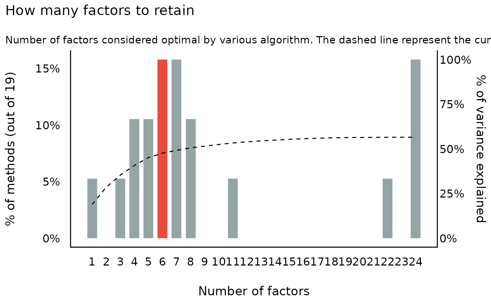

# Structural Models (EFA, CFA, SEM, ...)

## How to perform a Factor Analysis (FA)

The difference between PCA and EFA can be quite hard to intuitively
grasp as their output is very familiar. The idea is that PCA aims at
extracting the most variance possible from all variables of the dataset,
whereas EFA aims at creating consistent factors from the dataset without
desperately trying to represent all the variables.

This is why PCA is popular for feature reduction, as it will try to best
represent the variance contained in the original data, minimizing the
loss of information. On the other hand, EFA is usually in the context of
exploring the latent dimensions that might be hidden in the observed
variables, without necessarily striving to represent the whole dataset.

To illustrate EFA, let us use the [International Personality Item
Pool](https://ipip.ori.org/) data available in the
[`psych`](https://www.personality-project.org/r/html/bfi.html) package.
It includes 25 personality self report items. The authors built these
items following the **big 5** personality structure.

### Factor Structure (Sphericity and KMO)

The first step is to test if the dataset is suitable for carrying out
factor analysis. There are two

- **Bartlett’s Test of Sphericity**: This tests whether a matrix (of
  correlations) is significantly different from an identity matrix. The
  test provides probability that the correlation matrix has significant
  correlations among at least some of the variables in a dataset, a
  prerequisite for factor analysis to work. In other words, before
  starting with factor analysis, one needs to check whether Bartlett’s
  test of sphericity is significant.

- **Kaiser, Meyer, Olkin (KMO) Measure of Sampling Adequacy (MSA)**:
  This test was introduced by Kaiser (1970) as the Measure of Sampling
  Adequacy (MSA), later modified by Kaiser and Rice (1974). The
  Kaiser-Meyer-Olkin (KMO) statistic, which can vary from 0 to 1,
  indicates the degree to which each variable in a set is predicted
  without error by the other variables. A value of 0 indicates that the
  sum of partial correlations is large relative to the sum correlations,
  indicating factor analysis is likely to be inappropriate. A KMO value
  close to 1 indicates that the sum of partial correlations is not large
  relative to the sum of correlations and so factor analysis should
  yield distinct and reliable factors.

Both tests can be performed by using the
[`performance::check_factorstructure()`](https://easystats.github.io/performance/reference/check_factorstructure.html)
function. First, we set up the data.

``` r

library(parameters)
library(psych)

# Load the data
data <- psych::bfi[, 1:25] # Select only the 25 first columns corresponding to the items
data <- na.omit(data) # remove missing values
```

Next, we check test if the dataset is suitable for carrying out factor
analysis.

``` r

library(performance)
# Check factor structure
performance::check_factorstructure(data)
#> # Is the data suitable for Factor Analysis?
#> 
#> 
#>   - Sphericity: Bartlett's test of sphericity suggests that there is sufficient significant correlation in the data for factor analysis (Chisq(300) = 18146.07, p < .001).
#>   - KMO: The Kaiser, Meyer, Olkin (KMO) overall measure of sampling adequacy suggests that data seems appropriate for factor analysis (KMO = 0.85). The individual KMO scores are: A1 (0.75), A2 (0.84), A3 (0.87), A4 (0.88), A5 (0.90), C1 (0.84), C2 (0.80), C3 (0.85), C4 (0.83), C5 (0.86), E1 (0.84), E2 (0.88), E3 (0.90), E4 (0.88), E5 (0.89), N1 (0.78), N2 (0.78), N3 (0.86), N4 (0.89), N5 (0.86), O1 (0.86), O2 (0.78), O3 (0.84), O4 (0.77), O5 (0.76).
```

### Exploratory Factor Analysis (EFA)

Now that we are confident that our dataset is appropriate, we will
explore a factor structure made of 5 latent variables, corresponding to
the items’ authors theory of personality.

``` r

# Fit an EFA
efa <- psych::fa(data, nfactors = 5) %>%
  model_parameters(sort = TRUE, threshold = "max")

efa
#> # Rotated loadings from Factor Analysis (oblimin-rotation)
#> 
#> Variable |  MR2 |   MR1 |   MR3 |   MR5 |   MR4 | Complexity | Uniqueness
#> -------------------------------------------------------------------------
#> N1       | 0.83 |       |       |       |       |       1.07 |       0.32
#> N2       | 0.78 |       |       |       |       |       1.03 |       0.39
#> N3       | 0.70 |       |       |       |       |       1.08 |       0.46
#> N5       | 0.48 |       |       |       |       |       2.00 |       0.65
#> N4       | 0.47 |       |       |       |       |       2.33 |       0.49
#> E2       |      |  0.67 |       |       |       |       1.08 |       0.45
#> E4       |      | -0.59 |       |       |       |       1.52 |       0.46
#> E1       |      |  0.55 |       |       |       |       1.22 |       0.65
#> E5       |      | -0.42 |       |       |       |       2.68 |       0.59
#> E3       |      | -0.41 |       |       |       |       2.65 |       0.56
#> C2       |      |       |  0.67 |       |       |       1.18 |       0.55
#> C4       |      |       | -0.64 |       |       |       1.13 |       0.52
#> C3       |      |       |  0.57 |       |       |       1.10 |       0.68
#> C5       |      |       | -0.56 |       |       |       1.41 |       0.56
#> C1       |      |       |  0.55 |       |       |       1.20 |       0.65
#> A3       |      |       |       |  0.68 |       |       1.06 |       0.46
#> A2       |      |       |       |  0.66 |       |       1.03 |       0.54
#> A5       |      |       |       |  0.54 |       |       1.48 |       0.53
#> A4       |      |       |       |  0.45 |       |       1.74 |       0.70
#> A1       |      |       |       | -0.44 |       |       1.88 |       0.80
#> O3       |      |       |       |       |  0.62 |       1.16 |       0.53
#> O5       |      |       |       |       | -0.54 |       1.21 |       0.70
#> O1       |      |       |       |       |  0.52 |       1.10 |       0.68
#> O2       |      |       |       |       | -0.47 |       1.68 |       0.73
#> O4       |      |       |       |       |  0.36 |       2.65 |       0.75
#> 
#> The 5 latent factors (oblimin rotation) accounted for 42.36% of the total variance of the original data (MR2 = 10.31%, MR1 = 8.83%, MR3 = 8.39%, MR5 = 8.29%, MR4 = 6.55%).
```

As we can see, the 25 items nicely spread on the 5 latent factors, the
famous **big 5**. Based on this model, we can now predict back the
scores for each individual for these new variables:

``` r

predictions <- predict(
  efa,
  names = c("Neuroticism", "Conscientiousness", "Extraversion", "Agreeableness", "Opennness"),
  verbose = FALSE
)
# let's look only at the first five individuals
head(predictions, 5)
#>   Neuroticism Conscientiousness Extraversion Agreeableness Opennness
#> 1       -0.22            -0.128       -1.327        -0.855     -1.61
#> 2        0.16            -0.466       -0.572        -0.072     -0.17
#> 3        0.62            -0.141       -0.043        -0.552      0.23
#> 4       -0.12            -0.058       -1.063        -0.091     -1.06
#> 5       -0.17            -0.460       -0.099        -0.712     -0.66
```

### How many factors to retain in Factor Analysis (FA)

When running a **factor analysis (FA)**, one often needs to specify
**how many components** (or latent variables) to retain or to extract.
This decision is often motivated or supported by some statistical
indices and procedures aiming at finding the optimal number of factors.

There are a huge number of methods exist to statistically address this
issue, and they can sometimes give very different results.

> **Unfortunately, there is no consensus on which method to use, or
> which is the best.**

#### The Method Agreement procedure

The Method Agreement procedure, first implemented in the
[`psycho`](https://neuropsychology.github.io/psycho.R/2018/05/24/n_factors.html)
package (Makowski 2018), proposes to rely on the consensus of methods,
rather than on one method in particular.

This procedure can be easily used via the
[`n_factors()`](https://easystats.github.io/parameters/reference/n_factors.md)
function, re-implemented and improved in the
[**parameters**](https://github.com/easystats/parameters) package. One
can provide a dataframe, and the function will run a large number of
routines and return the optimal number of factors based on the higher
consensus.

``` r

n <- n_factors(data)
n
#> # Method Agreement Procedure:
#> 
#> The choice of 6 dimensions is supported by 3 (15.79%) methods out of 19 (Optimal coordinates, Parallel analysis, Kaiser criterion).
```

Interestingly, the smallest nubmer of factors that most methods suggest
is 6, which is consistent with the newer models of personality (e.g.,
HEXACO).

More details, as well as a summary table can be obtained as follows:

``` r

as.data.frame(n)
#>    n_Factors              Method              Family
#> 1          1 Acceleration factor               Scree
#> 2          3                 CNG                 CNG
#> 3          4                beta Multiple_regression
#> 4          4    VSS complexity 1                 VSS
#> 5          5    VSS complexity 2                 VSS
#> 6          5       Velicer's MAP        Velicers_MAP
#> 7          6 Optimal coordinates               Scree
#> 8          6   Parallel analysis               Scree
#> 9          6    Kaiser criterion               Scree
#> 10         7                   t Multiple_regression
#> 11         7                   p Multiple_regression
#> 12         7          Scree (R2)            Scree_SE
#> 13         8          Scree (SE)            Scree_SE
#> 14         8                 BIC                 BIC
#> 15        11      BIC (adjusted)                 BIC
#> 16        22             Bentler             Bentler
#> 17        24            Bartlett             Barlett
#> 18        24            Anderson             Barlett
#> 19        24              Lawley             Barlett
summary(n)
#>    n_Factors n_Methods Variance_Cumulative
#> 1          1         1                0.19
#> 2          3         1                0.35
#> 3          4         2                0.41
#> 4          5         2                0.45
#> 5          6         3                0.48
#> 6          7         3                0.49
#> 7          8         2                0.51
#> 8         11         1                0.53
#> 9         22         1                0.57
#> 10        24         3                0.57
```

A plot can also be obtained (the `see` package must be loaded):

``` r

library(see)

plot(n) + theme_modern()
```



### Confirmatory Factor Analysis (CFA)

We’ve seen above that while an EFA with 5 latent variables works great
on our dataset, a structure with 6 latent factors might in fact be more
appropriate. How can we **statistically test** if that is actually the
case? This can be done using **Confirmatory Factor Analysis (CFA)** (as
opposed to **Exploratory** FA), which bridges factor analysis with
Structural Equation Modeling (SEM).

However, in order to do that cleanly, EFA should be **independent** from
CFA: the factor structure should be explored in a **“training” set**,
and then tested (or “confirmed”) in a **“testing” set**.

In other words, the dataset used for exploration and confirmation should
not be the same, a standard widely adopted in the field of machine
learning.

#### Partition the data

The data can be easily split into two sets with the `data_partition()`
function, through which we will use 70% of the sample as training and
the rest as test.

``` r

# to have reproducible result, we will also set seed here so that similar
# portions of the data are used each time we run the following code
partitions <- datawizard::data_partition(data, training_proportion = 0.7, seed = 111)
training <- partitions$p_0.7
test <- partitions$test
```

#### Create CFA structures out of EFA models

In the next step, we will run two EFA models on the training set,
specifying 5 and 6 latent factors respectively, that we will then
transform into CFA structures.

``` r

structure_big5 <- psych::fa(training, nfactors = 5) %>%
  efa_to_cfa()
structure_big6 <- psych::fa(training, nfactors = 6) %>%
  efa_to_cfa()

# Investigate how the models look
structure_big5
#> # Latent variables
#> MR2 =~ N1 + N2 + N3 + N4 + N5 + .row_id
#> MR1 =~ E1 + E2 + E3 + E4 + E5
#> MR3 =~ C1 + C2 + C3 + C4 + C5
#> MR5 =~ A1 + A2 + A3 + A4 + A5
#> MR4 =~ O1 + O2 + O3 + O4 + O5

structure_big6
#> # Latent variables
#> MR2 =~ N1 + N2 + N3 + N5 + .row_id
#> MR3 =~ C1 + C2 + C3 + C4 + C5
#> MR1 =~ E1 + E2 + E4 + E5 + N4 + O4
#> MR5 =~ A1 + A2 + A3 + A4 + A5
#> MR4 =~ E3 + O1 + O2 + O3
#> MR6 =~ O5
```

As we can see, a structure is just a string encoding how the **manifest
variables** (the observed variables) are integrated into **latent
variables**.

#### Fit and Compare models

We can finally apply this structure to the testing dataset using the
`lavaan` package, and compare these models against each other:

``` r

library(lavaan)
library(performance)

big5 <- suppressWarnings(lavaan::cfa(structure_big5, data = test))
big6 <- suppressWarnings(lavaan::cfa(structure_big6, data = test))

performance::compare_performance(big5, big6, verbose = FALSE)
#> # Comparison of Model Performance Indices
#> 
#> Name |  Model |     Chi2 | Chi2_df | p (Chi2) | Baseline(325) | p (Baseline)
#> ----------------------------------------------------------------------------
#> big5 | lavaan | 1366.793 |     289 |   < .001 |      5413.276 |       < .001
#> big6 | lavaan | 1504.653 |     285 |   < .001 |      5413.276 |       < .001
#> 
#> Name |   GFI |  AGFI |   NFI |  NNFI |   CFI | RMSEA |      RMSEA  CI
#> ---------------------------------------------------------------------
#> big5 | 0.861 | 0.831 | 0.748 | 0.762 | 0.788 | 0.071 | [0.068, 0.075]
#> big6 | 0.854 | 0.820 | 0.722 | 0.727 | 0.760 | 0.077 | [0.073, 0.080]
#> 
#> Name | p (RMSEA) |    RMR |  SRMR |   RFI |  PNFI |   IFI |   RNI
#> -----------------------------------------------------------------
#> big5 |    < .001 | 12.332 | 0.076 | 0.716 | 0.665 | 0.790 | 0.788
#> big6 |    < .001 | 12.595 | 0.083 | 0.683 | 0.633 | 0.762 | 0.760
#> 
#> Name | Loglikelihood |   AIC (weights) |   BIC (weights) | BIC_adjusted
#> -----------------------------------------------------------------------
#> big5 |    -35860.601 | 71845.2 (>.999) | 72130.1 (>.999) |    71933.186
#> big6 |    -35929.531 | 71991.1 (<.001) | 72294.3 (<.001) |    72084.722
```

All in all, it seems that the Big-5 structure remains quite reliable.

## Structural Equation Modeling

The previous example shows one of the enormous amount of modeling
possibilities for structural equation models, in particular an example
for mediation analysis, i.e. a model that estimates indirect effects in
partial mediation structures.

``` r

set.seed(1234)
X <- rnorm(100)
M <- 0.5 * X + rnorm(100)
Y <- 0.7 * M + rnorm(100)
df <- data.frame(X = X, Y = Y, M = M)

model <- " # direct effect
             Y ~ c*X
           # mediator
             M ~ a*X
             Y ~ b*M
           # indirect effect (a*b)
             ab := a*b
           # total effect
             total := c + (a*b)
         "
fit <- lavaan::sem(model, data = df, test = "Satorra-Bentler")
model_parameters(fit)
#> # Regression
#> 
#> Link      | Coefficient |   SE |        95% CI |    z |      p
#> --------------------------------------------------------------
#> Y ~ X (c) |        0.04 | 0.10 | [-0.17, 0.24] | 0.35 | 0.728 
#> M ~ X (a) |        0.47 | 0.10 | [ 0.27, 0.68] | 4.61 | < .001
#> Y ~ M (b) |        0.79 | 0.09 | [ 0.61, 0.97] | 8.54 | < .001
#> 
#> # Defined
#> 
#> To      | Coefficient |   SE |       95% CI |    z |      p
#> -----------------------------------------------------------
#> (ab)    |        0.37 | 0.09 | [0.19, 0.55] | 4.06 | < .001
#> (total) |        0.41 | 0.12 | [0.17, 0.65] | 3.29 | 0.001
```

## References

Makowski, Dominique. 2018. “The Psycho Package: An Efficient and
Publishing-Oriented Workflow for Psychological Science.” *Journal of
Open Source Software* 3 (22): 470.
