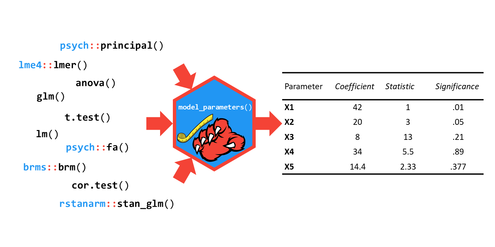
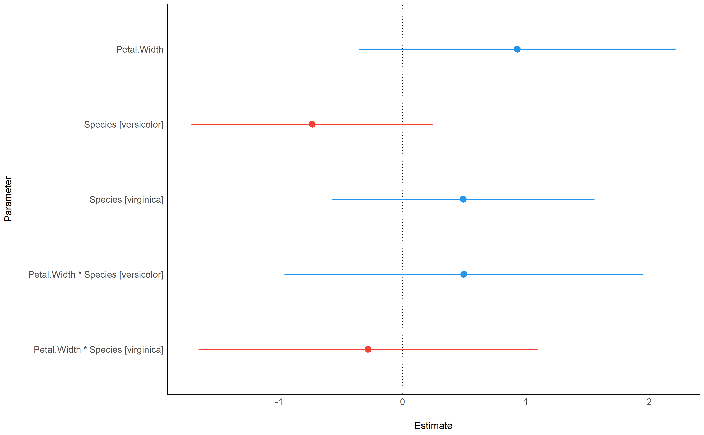

# Introduction

The recent growth of data science is partly fuelled by the ever-growing amount of data and the joint important developments in statistical modelling. New and powerful models and frameworks are becomming accessible to users, however, although there exist some generic functions to obtain model summaries and parameters, many package-specific modeling functions do not provide such methods to allow users to access such valuable information. 

*parameters* is an R-package [@rcore] that fills this important gap. Its primary goal is to provide utilities for processing the parameters of various statistical models. Beyond computing p-values, standard errors, confidence intervals, Bayesian indices and other measures for a wide variety of models, this package implements features like parameters bootstrapping and engineering (such as variables reduction and/or selection).

It relies on the **insight** and the **bayestestR** packages [@ludecke2019insight; @makowski2019bayestestR] to access and process information contained in models.

# Examples of Features


## Parameters Tables



``` r
library(parameters)

model <- lm(Sepal.Length ~ Species, data=iris)
parameters(model)

#> Parameter            | Coefficient |   SE |       95% CI |     t |  df |      p
#> -------------------------------------------------------------------------------
#> (Intercept)          |        5.01 | 0.07 | [4.86, 5.15] | 68.76 | 147 | < .001
#> Species [versicolor] |        0.93 | 0.10 | [0.73, 1.13] |  9.03 | 147 | < .001
#> Species [virginica]  |        1.58 | 0.10 | [1.38, 1.79] | 15.37 | 147 | < .001
```


## Visualisation


**parameters** functions also include plotting capabilities via the [**see** package](https://easystats.github.io/see/) [@ludecke2019see].

```r
library(see)

lm(Sepal.Length ~ Petal.Width * Species, data=iris) %>%
  parameters() %>%
  plot()
```


# Licensing and Availability

**parameters** is licensed under the GNU General Public License (v3.0), with all source code stored at GitHub (https://github.com/easystats/parameters), and with a corresponding issue tracker for bug reporting and feature enhancements. In the spirit of honest and open science, we encourage requests/tips for fixes, feature updates, as well as general questions and concerns via direct interaction with contributors and developers.

# Acknowledgments

**parameters** is part of the [*easystats*](https://github.com/easystats/easystats) ecosystem, a collaborative project created to facilitate the usage of R. Thus, we would like to thank the [members of easystats](https://github.com/orgs/easystats/people) of easystats as well as the users.

# References
